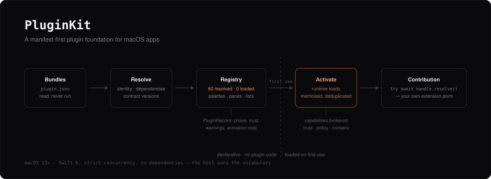

<p align="center">
  
</p>

<p align="center">
  <a href="#requirements"></a>
  <a href="#requirements"></a>
  <a href="#requirements"></a>
  <a href="#requirements"></a>
  <a href="LICENSE"></a>
  <a href="docs/"></a>
</p>

<p align="center">
  <a href="docs/getting-started.md">Getting started</a> ·
  <a href="docs/plugin-development.md">Writing a plugin</a> ·
  <a href="docs/capabilities.md">Capabilities</a> ·
  <a href="docs/architecture.md">Architecture</a> ·
  <a href="docs/troubleshooting.md">Troubleshooting</a>
</p>

---

**PluginKit** is a plugin foundation for macOS apps. It handles declaration, discovery,
versioning, ordering, permission brokering, and lazy loading — and knows nothing at all
about what your app does.

It is built around one rule, and everything else follows from it:

> **The host decides from data, not from code.**

Identity, dependencies, contract versions, menu titles, and every permission a plugin will
ever request live in a manifest, and are validated *before* a single byte of plugin code is
mapped into the process. A host with sixty installed plugins boots with sixty **resolved**
and **zero loaded** — it builds its whole command palette from manifests, then loads a
plugin the first time someone actually uses it.

The alternative is the shape most plugin systems drift into: load everything at launch to
find out what is there, discover a plugin is broken by crashing, and describe permissions in
documentation the code does not enforce.

```swift
// The entire host-side integration for a command palette. No plugin code is loaded.
for handle in await manager.contributions(to: CommandPoint.self) {
    palette.add(title: handle.metadata.title, category: handle.metadata.category) {
        let command = try await handle.resolve()          // ← loads here, on click
        _ = try await command.handle(RunCommand(text: editor.selection))
    }
}
```

## What it does

- **Manifest-first discovery** — identity, dependencies, contract versions, metadata shape,
  and requested permissions all checked before any code exists in the process
- **Typed extension points** you declare, with arity, ordering, and per-point versioning
- **Lazy activation** — memoised, deduplicated across concurrent callers, cycle-safe
- **Capability brokering** with scope attenuation, layered policy, and user consent
- **Trust evaluation** from code signature, team ID, quarantine, and framework linkage
- **Pluggable runtimes** behind one interface, so isolation is a deployment choice
- **Layered configuration** (session → managed → user → bundled → default) with MDM locks
- **Authoring tools** — a `pluginkit` CLI, a plugin-side harness, a conformance suite

## Requirements

macOS 13+ · Swift 6.0+ · strict concurrency (`swiftLanguageModes: [.v6]`) · no external
dependencies.

macOS-only by design. The trust model, the runtime backends, and the filesystem conventions
have no meaningful analogue elsewhere, and pretending otherwise would produce a
lowest-common-denominator API.

## Install

### Xcode

**File → Add Package Dependencies…**, then paste:

```
https://github.com/gumbracelet/PluginKit.git
```

### Package.swift

```swift
dependencies: [
    // Pre-1.0: pin the minor. Semver lets a 0.x minor bump break, and PluginKit
    // follows that rule in code as well as in policy.
    .package(url: "https://github.com/gumbracelet/PluginKit.git",
             .upToNextMinor(from: "0.1.0"))
],
```

### Which product to link

PluginKit ships **six products**, and you link different ones depending on which side of the
boundary you are on. That separation is the point — see [architecture](docs/architecture.md).

| Product | Link from | Contains |
|---|---|---|
| `PluginKitCore` | **your vocabulary target** | The shared contract: manifest, extension points, `Plugin`, `PluginContext`, capabilities. The only product both a host *and* a plugin link. |
| `PluginKitHost` | your app | `PluginManager`, discovery, trust, catalog, brokers, config, storage. |
| `PluginKitInProcess` | your app | The in-process runtime. Link only the runtimes you ship. |
| `PluginKitSDK` | a plugin | `PluginPrincipal`, `PluginManifestBuilder`, context conveniences. **Never link into an app.** |
| `PluginKitTesting` | test targets | `PluginHarness`, `HostHarness`, `PluginConformance`. |
| `pluginkit` (executable) | plugin authors | `describe`, `validate`, `init`. |

A host package:

```swift
targets: [
    .target(name: "AcmeEditor", dependencies: [
        .product(name: "PluginKitHost", package: "PluginKit"),
        .product(name: "PluginKitInProcess", package: "PluginKit"),
        "AcmeEditorPluginAPI",
    ]),

    // Your published vocabulary. PluginKitCore only — if it can import your app,
    // third-party authors will not be able to compile against it.
    .target(name: "AcmeEditorPluginAPI", dependencies: [
        .product(name: "PluginKitCore", package: "PluginKit"),
    ]),

    .testTarget(name: "AcmeEditorTests", dependencies: [
        "AcmeEditor",
        .product(name: "PluginKitTesting", package: "PluginKit"),
    ]),
]
```

A plugin links `PluginKitSDK` plus the host's vocabulary package — never `PluginKitHost`.

---

## Quick start

Three steps. The [getting started guide](docs/getting-started.md) covers each in full.

### 1. Declare your vocabulary

PluginKit ships **zero** domain extension points. Your app declares its own, in a target
that depends on `PluginKitCore` and nothing else — that target is what plugin authors
compile against.

```swift
import PluginKitCore

public struct RunCommand: Codable, Sendable { public var text: String }
public struct CommandResult: Codable, Sendable { public var didHandle: Bool }

public protocol Command: RemotableContract
    where Request == RunCommand, Response == CommandResult {}

public enum CommandPoint: RemotableExtensionPoint {
    public typealias Contract = any Command
    public typealias Request = RunCommand
    public typealias Response = CommandResult

    /// The declarative half — read from the manifest, no code loaded.
    public struct Metadata: Codable, Sendable {
        public let title: String
        public var category: String?
    }

    public static let extensionPointID: ExtensionPointID = "com.acme.editor.command"
    public static let vocabulary: VocabularyID = "com.acme.editor.api"
    public static let contractVersion: SemanticVersion = "1.0.0"

    /// One line per point. This is what makes location transparency mechanically
    /// true rather than merely asserted.
    public static func invoke(
        _ contract: Contract, with request: RunCommand
    ) async throws -> CommandResult {
        try await contract.handle(request)
    }
}
```

### 2. Wire up the host

```swift
import PluginKitHost
import PluginKitInProcess

let manager = PluginManager(
    configuration: .standard(
        appIdentifier: "com.acme.editor",
        appVersion: "3.2.0",
        consent: CallbackConsentStore { prompt in
            await PermissionSheet.present(prompt)     // your UI
        }
    ) { configuration in
        configuration.extensionPoints.register(CommandPoint.self)

        configuration.capabilities.register(FileReading.self) { scope, plugin in
            FileReading(grantedRoots: scope.roots) { path in
                try await ScopedReader(roots: scope.roots).read(path)
            }
        }

        configuration.runtimes = [
            InProcessPluginRuntime.registering([
                "com.acme.editor.markdown": { MarkdownPlugin() },
            ])
        ]
    }
)

await manager.start()      // does not throw — a launch path must produce *some* state
```

`.standard` gives you machine-wide, bundled, user, and development plugin directories in
descending precedence; file-backed settings and storage; and a prompt-for-sensitive
capability policy. **No runtime is included by default** — choosing where untrusted code
runs is the most consequential decision in the framework, and should not hide inside a
convenience initialiser.

### 3. Write a plugin

```swift
import PluginKitSDK
import AcmeEditorPluginAPI

actor MarkdownPlugin: Plugin {
    private var files: FileReading?

    init() {}

    func activate(_ context: any PluginContext) async throws {
        // Optional capability: degrade rather than refuse to load.
        files = await context.optionalCapability(FileReading.self)
        let reader = files

        try await context.register(CommandPoint.self, name: "render") {
            RenderCommand(files: reader)     // not called until first use
        }
    }

    func deactivate() async { files = nil }  // must be idempotent
}
```

Its `plugin.json`, inside the bundle at `Contents/Resources/`:

```json
{
  "id": "com.acme.editor.markdown",
  "version": "1.0.0",
  "displayName": "Markdown Tools",
  "sdkVersion": ">=0.1.0 <0.2.0",
  "contracts": [
    { "vocabulary": "com.acme.editor.api", "builtAgainst": "1.0.0" }
  ],
  "capabilities": [
    { "id": "fs.read", "required": false,
      "reason": "Reads the open file to render a preview.",
      "scope": { "roots": ["~/Documents"] } }
  ],
  "contributions": [
    { "extensionPoint": "com.acme.editor.command", "name": "render",
      "contractVersion": "1.0.0", "priority": 10,
      "metadata": { "title": "Render Markdown", "category": "Text" } }
  ]
}
```

Every optional key has a defensible default, so the shortest useful manifest is three lines.

---

## Four things worth knowing before you commit

### The manifest is authoritative

A plugin cannot contribute to a point, request a capability, or publish a service it did not
declare. Not "warn and allow" — **refuse**:

```swift
try await context.register(CommandPoint.self, name: "undeclared") { … }
// throws ExtensionPointError.contributionNotFound

let net = try await context.capability(NetworkAccess.self)
// throws CapabilityError.undeclared, before policy is even consulted
```

A drift check for the honest case, a containment boundary for the dishonest one. The
plugin-side harness reports the same differences as a build-time diff, so it is caught at the
author's desk rather than on a user's machine.

### In-process capabilities are policy, not enforcement

Read this before designing a permission UI.

A native plugin loaded into your address space can call `FileManager` directly, ignore the
broker, and take the process down with it. Capabilities become real enforcement only
out-of-process, where a child's sandbox profile derives from the granted set.

`PluginRecord.trustSummary` says which one a given plugin is getting — *"full app access"*
rather than a tidy permission list that implies containment you do not have. Bind your UI to
it. A permission list that lies is worse than none, because the user then makes decisions
based on it. [Details](docs/capabilities.md#the-honest-part).

### Nothing fails silently

Every plugin that cannot run is *listed*, in a phase, with a structured reason:

```swift
for record in await manager.plugins() {
    Row(record.manifest.displayName,
        state: record.phase,                       // .resolved, .active, .unsatisfied…
        problem: record.unsatisfied?.description,  // a complete sentence, for a user
        warnings: record.warnings,                 // deprecations, denied optionals
        cost: record.activationDuration)
}
```

`unsatisfied` is a steady, visible state — not a silent drop.

### Isolation is a deployment choice, not a rewrite

Extension points are **remotable by default**, and the opt-out (`LocalExtensionPoint`)
requires a written reason that shows up in tooling. A remotable contract runs unchanged
in-process, over XPC, in an app extension, or in a script runtime.

The test harness proves it before you need it:

```swift
PluginHarness(manifest: manifest, transport: .serializing)
```

Every request and response crosses a JSON round-trip, catching the assumptions that make a
contract quietly un-remotable — with none of the setup an actual out-of-process test needs.

---

## Documentation

| Guide | Read it when |
|---|---|
| [Getting started](docs/getting-started.md) | Adding PluginKit to an app, end to end. |
| [Architecture](docs/architecture.md) | Choosing where your code goes, or changing PluginKit. |
| [Extension points](docs/extension-points.md) | Designing a vocabulary that survives version 2. |
| [Plugin development](docs/plugin-development.md) | Writing a plugin. Hand this to your authors. |
| [Capabilities and trust](docs/capabilities.md) | Deciding what plugins may do. |
| [Lifecycle](docs/lifecycle.md) | Phases, activation triggers, failure handling. |
| [Configuration and storage](docs/configuration.md) | Settings, managed profiles, containers. |
| [Testing](docs/testing.md) | Testing a plugin without a host, or vice versa. |
| [Distribution](docs/distribution.md) | Versioning, releases, packaging, code signing. |
| [Troubleshooting](docs/troubleshooting.md) | Something is wrong. Symptom → cause → fix. |
| [Design notes](DESIGN.md) | The reasoning behind the design, including rejected options. |

## Testing

```console
$ swift test
Test run with 110 tests in 13 suites passed.
```

The suite asserts the claims that break silently rather than chasing coverage: that listing
sixty contributions constructs zero plugins; that eight concurrent resolutions activate once;
that undeclared registrations are refused; that a sandboxed-only plugin fails closed rather
than silently gaining full authority; that storage keys cannot escape their container.

`Tests/PluginKitTests/` is worth reading as worked examples.

## Releases

Versions come from git tags — PluginKit is a source-distributed SwiftPM package, so the tag
*is* the version and there is nothing else to keep in sync.

**Normal path:** GitHub → Actions → **Release** → Run workflow, pick `patch` / `minor` /
`major`. The workflow computes the next version from the newest tag, runs the tests and the
library-evolution check, generates release notes from conventional commits, writes
`CHANGELOG.md`, tags, and publishes. Everything that can fail runs *before* the repository is
touched, so a broken build never leaves a stray tag behind. `dry_run` rehearses it.

**Escape hatch:** push a `vX.Y.Z` tag by hand; the same workflow verifies and publishes.

**Locally:** `Scripts/pluginkit-release minor --dry-run`.

The changelog is generated by `Scripts/pluginkit-changelog` — conventional commits, emoji
sections, compare links, no Node and no dependencies. See
[CHANGELOG.md](CHANGELOG.md) and [distribution.md](docs/distribution.md#cutting-a-release).

## Honest limits

What this version does **not** do, stated plainly rather than discovered later:

- **Only one runtime ships** (`InProcessPluginRuntime`). Until an isolating runtime exists, a
  `sandboxedOnly` plugin is reported `unsatisfied` with a readable reason rather than quietly
  given full authority. Opt out with
  `DefaultRuntimeSelector(allowsUnisolatedFallback: true)`; the plugin is then flagged
  `.unisolated`.
- **No XPC, app-extension, or script runtime yet.** Their seams are in place, and the
  serializing test transport already proves contracts survive the boundary.
- **No contract adapters.** A contribution outside the accepted version range is reported
  with both versions and the host's guidance, but cannot yet be translated forward.
- **No macros.** `plugin.json` is hand-written or built with `PluginManifestBuilder`; drift is
  *caught* by `PluginHarness.drift()` rather than made impossible.
- **No UI module.** `PluginRecord` carries everything a manager pane needs; drawing it is
  yours.
- **No marketplace, no install/uninstall flow, no production hot reload.** Deliberate
  anti-goals, not omissions.

[Roadmap](docs/distribution.md#roadmap).

## License

MIT. See [LICENSE](LICENSE).
